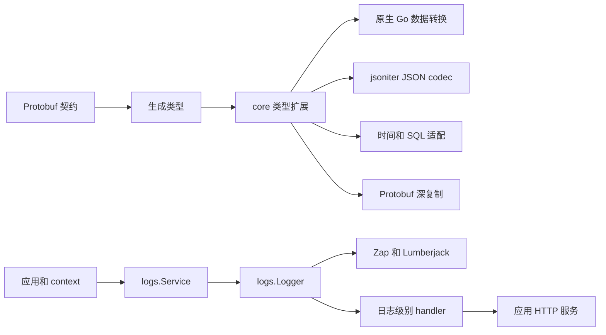

# Core 架构与函数说明

本仓库提供 Fino 共享的 Protobuf 契约和 Go 基础运行时。Go 模块位于 `go/`，最低语言版本为 Go 1.22。

## 分层与职责

| 层 | 位置 | 职责 |
| --- | --- | --- |
| 契约 | `proto/fino/core/` | 值、时间、错误、URL、文件、资源和版本等共享消息。 |
| 生成选项 | `proto/fino/options.proto` | 模型和服务的生成配置。 |
| 生成类型 | `go/fino/core/*.pb.go` | 消息、枚举、描述符和 getter，由生成器维护。 |
| 类型扩展 | `go/fino/core/` 的手写文件 | Go 数据转换、集合操作、JSON codec、SQL 适配及错误分类。 |
| 日志 | `go/logs/` | 日志接口、上下文字段、Zap 适配和 Lumberjack 文件轮转。 |

生成文件保留生成器的写法，包括 `interface{}`；手写代码使用 `any`。枚举的 `.fmt.go`、`.json.go` 同样是生成文件，以 `Code generated` 文件头为准。枚举 JSON helper 只调用 `RegisterJSONEnum`，校验和编码逻辑集中在手写的 `enum.json.go`。改变生成行为时同步更新 Fino 模板并重新生成 helper。



`logs` 和 `core` 可独立使用。应用导入 `core` 后，其 JSON codec 注册也会影响日志反射编码中的这些类型。

## 生成选项与文件契约

`DBOptions` 的 `len/default/comment/index/unique_index` 和 `ValidateOptions` 的 `len/min/max/oneof` 使用 `optional`。缺省不产生约束；显式零值、空字符串保留字段存在性。Go 调用方使用 `proto.Int64`、`proto.String` 构造字段，通过指针是否为 nil 区分缺省值，不能仅依赖 getter。字段类型和含义由 `proto/fino/options.proto` 的注释定义。

`File.name` 保存名称，`File.mode` 是唯一文件类型，`MODE_DIR` 表示目录、`MODE_FILE` 表示普通文件、零表示未知。`File.info` 仅保存元数据；`change_time` 是元数据变更时间，`modify_time` 是内容修改时间。目录子项使用 `files`，普通文件不包含子项。重复的 `is_dir` 和 `Info.name` 已删除。

## 数据转换与 JSON

| 入口 | 语义 |
| --- | --- |
| `NewValue`、`New*Value` | 原生标量、字符串键映射和数组递归转换为 Protobuf oneof，保留整数精度、浮点种类和二进制数据；结构体按 JSON 标签和注册的编码器转换。 |
| `NewObjectFromMap`、`NewValues` | 复用 `NewValue` 的转换与校验，不再单独递归构建集合。 |
| `New*ArrayValue`、`Get*Array` | 共用元素映射逻辑，保留 nil/非 nil 空切片；原始元素统一通过 `Value.GetValues` 读取。 |
| `Value.AsInterface`、`Object.AsMap`、`Values.AsSlice` | 返回原生 Go 值，包括原始字符串、字节切片和非有限浮点。 |
| `Object.From`、`NewObjectFrom` | 转换并深复制对象内容；成功替换全部字段，null 清空，错误保留旧值；构造失败返回 nil 和错误。 |
| `Object.To` | 按原生数据的 JSON 表示写入非 nil 指针；目标类型仍需能接受相应数据。 |
| `Merge`、`Clone` | `Merge` 共享嵌套值，`Clone` 深复制并保留集合的 nil/empty 形态。 |
| `ToLowerCamelKeys`、`ToSnakeKeys` | 返回转换后的新对象；键名冲突返回错误。 |
| `StringValues.Contains` | 返回 bool；正则过滤使用编译后的标准库表达式。 |
| `NewUrlQuery`、查询 `Add/Set` | 接受标量及标量集合，包括命名类型；不支持的值返回错误，失败不修改已有参数。 |
| `FromUrlValues` | 深复制查询参数并替换全部键；不保留旧参数，也不共享源切片。 |
| `UnmarshalParam`、查询 `Unmarshal` | 标量优先使用 `Parser`，失败保留目标值；查询列表逐个解析重复参数，保留字面字符串，`UnmarshalParam` 显式支持逗号或 JSON 列表。 |
| `Url.Format`、`FormatWithoutScheme` | `Format` 保留标准 URL 的 scheme 和 authority 前缀；后者返回省略 scheme 与 `//` 的展示文本。 |

`From2` 已删除，转换统一使用 `From`。已有 `Object` 和值映射保留 oneof 类型；结构体中的数字由 JSON 表示决定。`Clone` 保留 Protobuf 未知字段，`From` 只替换目标对象的字段映射。

原生集合不再经过 JSON 中转，因此 `map[string][]byte` 中的元素仍为二进制，`[]float64{1}` 的元素仍为浮点，命名类型和普通指针采用同一转换规则。映射键必须是字符串，字符串与键统一检查 UTF-8。转换检测原生映射、切片和指针的循环引用，正常共享子对象及重叠切片可以转换；错误包含字段名或元素下标。结构体的自定义编码仍由 jsoniter 处理。

查询参数只接受标量或一层标量集合；嵌套集合返回错误，避免递归展开产生歧义和循环引用。空集合的 nil/empty 形态与普通、命名类型一致。

字符串转换统一使用 `ToStringConverter` 和 `Formatter`，`ToString` 与查询参数共享标量格式化逻辑；nil 指针不会调用格式化方法。重复的 `StringLike`、`ValuesCodec`、`NewValueCodec` 和 `ValueCodec.DecodeAny` 已移除。

JSON codec 的职责是保留数据类型的传输表示：

- 普通 JSON 编解码直接使用 jsoniter 默认入口，保留完整浮点精度和默认 HTML 转义，不再维护额外的全局配置。`Object.To` 和结构体转 Value 的动态解码使用 decoder 的 `UseNumber`，将数字保留为 `json.Number`，避免整数精度损失。
- 动态数据转换先用标准库 `json.Valid` 校验完整 JSON，非法 RawMessage 或自定义编码结果返回错误；不使用 jsoniter 会将非法 RawMessage 静默替换为 null 的校验选项。
- `Value` 的字符串和 `Object` 的键在 JSON 编解码边界校验 UTF-8，嵌套非法数据返回错误。
- nil 映射/切片输出 `null`，非 nil 空集合输出 `{}`/`[]`；深复制保留这一区别。
- 二进制值输出 `"b64.<base64>"`，NaN 和无穷输出 `"NaN"`、`"Infinity"`、`"-Infinity"`。
- 有限浮点使用完整精度，并保留小数点或指数；例如浮点 `1` 输出 `1.0`，整数输出 `1`，往返后仍可区分整数与浮点，也保留负零。
- 普通字符串若与保留值冲突，或以 `str.` 开头，输出时加 `str.` 前缀；解码先移除这一层转义。因此字符串 `NaN` 和浮点 NaN 可以分别往返。
- `NewValue` 和 `Object.From` 处理普通 Go 输入时保留字符串原值，只有 Value wire codec 解释保留前缀。
- 紧凑 JSON 使用 jsoniter codec；`protojson` 使用契约字段表示，两套协议各自使用。
- `Value`、`Object`、`Values`、`Timestamp`、`Duration`、`Url` 也实现标准 JSON 方法，复用紧凑 codec；完整输入成功后才替换接收者字段。普通 HTTP JSON 编码无需额外注册。
- `Value`、`Object`、`Values` 提供 `CheckValid`，检查嵌套字符串、键、负数幅值和循环引用。标准 JSON 和 jsoniter 编码入口都拒绝循环值，允许共享子对象。负整数幅值为 1 到 2^63；越界 JSON 整数返回错误，不降级为浮点。需要浮点数据时使用带小数点或指数的 JSON 数字。
- 原生 Go 视图与 wire JSON 的表示可能不同。标准 `encoding/json` 无法输出原生 NaN、Infinity；需要传输这些值时使用 Value codec。
- 包装标量、切片、映射和 `Values` 共用字段 codec，直接在外层 iterator/stream 上读写，继承外层的转义和键排序配置，避免中间 JSON 缓冲。字段解码失败保留旧值，null 清零或清空；映射成功解码替换全部键，`StringsMap` 保留值为 null 的条目。
- 标准 `MarshalJSON` 方法直接编码内部字段，不依赖自身 codec 的注册优先级；`UnmarshalJSON` 通过 `decodeJSON` 解码到临时字段，完整输入解码成功后才替换原值，尾随内容导致的错误同样保留原值。
- `RegisterJSONValuesCodec` 是集合注册入口；实现与其他包装类型统一在 `jsoniter.go`，不再使用独立的 `ValsCodec`。
- 枚举接受已知名称和严格 JSON 整数；拒绝小数、指数、未知值及非法数字，null 清零。

## 时间与 SQL

`Timestamp` 保存 Unix 秒和纳秒。`CheckValid` 复用标准 Protobuf 时间校验，允许公元 1–9999 年、0–999999999 纳秒；解析、JSON、SQL 和带 error 的加法入口执行校验。`FromTime` 和无 error 的原始字段访问保留现有签名，直接构造后可显式校验。字符串解析复用 dateparse，不改写输入时区；数值 JSON 按 Unix 秒解码，输出统一为 UTC `time.RFC3339Nano`，保留纳秒精度。查询参数通过 `net/url` 编解码，时区中的 `+` 应编码为 `%2B`；nil 接收者解析返回错误。

`Duration` 保存 int64 秒和纳秒，JSON 输出精确的十进制秒字符串，例如 `"10000000000.123456789s"`。解析精确秒数复用标准库 `math/big`，按纳秒舍入；输入的小时、分钟等写法仍由 `time.ParseDuration` 处理。比较按实际时长进行。

`Duration.CheckValid` 保留完整 int64 秒范围，要求纳秒绝对值小于 10^9，且秒与纳秒同号；JSON、SQL 和 Go 时长转换拒绝非法字段。

`Date`、`TimeOfDay`、`DateTime` 提供 `CheckValid`、`Parse`、`Format` 和 `FromTime`。`Date.ToTime` 接受 location，nil 使用 UTC，并拒绝被时区规则跳过的本地日期；`TimeOfDay.ToDuration` 返回当日时长；`DateTime.ToTime` 使用其时区，并拒绝时区跳变中不存在的本地时间。日期必须完整有效，年份为 1–9999。

`TimeZone.Location` 优先解析 IANA 名称，无名称时使用秒为单位的 UTC 偏移，固定偏移必须为整分钟且绝对值小于 24 小时；nil 时区为 UTC。夏令时回拨中的重复时间沿用 `time.Date` 的选择。`DateTime.Format` 输出 RFC3339Nano 偏移文本，不保留 IANA 名称。

`DateTime.FromTime` 若不能仅靠时区名称还原原始瞬间（例如夏令时回拨中的另一个瞬间或重名固定时区），则保存固定偏移，保证转换往返保留瞬间。

| 函数 | 返回与约束 |
| --- | --- |
| `NewDuration(float64)` | `(*Duration, error)`；拒绝非有限和越界输入。 |
| `Duration.FromSeconds(float64)` | `error`；失败不修改接收者。 |
| `Duration.ToDuration()` | `(time.Duration, error)`；检查 Go int64 纳秒范围。 |
| `Duration.ToNanoSeconds()` | `(int64, error)`；同样检查溢出。 |
| `Timestamp.Add(*Duration)` | `(*Timestamp, error)`；检查时长转换。 |
| `Duration.ToSeconds/ToMinutes/ToHours` | float64 近似值；精确存储使用字段或格式化字符串。 |

SQL NULL 扫描到时间类型时清零。`Duration.Value` 输出精确秒数字符串，`GormDataType` 为 `text`；不再经 float64 写出。`Timestamp.Value` 使用 `time.Time`。两者都拒绝不支持的扫描类型。

## 错误

分类构造器统一返回 `*Error`，通过错误码和领域区分分类，删除嵌入指针的分类包装结构及其错误链转发。`errors.Is` 匹配码和领域，`errors.As`/`AsError` 提取包装后的共享错误；`&Error{}` 可作为类别通配目标。

`NewError` 深复制错误码；JSON 直接编码完整的 `ErrorCode` 结构，保留业务码的名称、领域、描述、文档 URL 和 HTTP 状态。`ErrorCode.Parse` 校验成功后替换全部元数据。`AddDetail` 返回转换错误，失败不追加内容。无有效 HTTP 状态时 `StatusCode` 返回 500。

## 日志与生命周期

`Service` 保存不可变的 logger/context 配置，`WithLogger`、`WithContext` 返回派生实例；全局 `SetLogger` 使用锁替换默认服务。级别调整复用 Zap AtomicLevel。日志字段按初始配置、派生 logger、上下文、单次调用的顺序覆盖。

`NewLoggerWith` 校验配置并返回 `(Logger, error)`；`NewLoggerWithWriter` 接入调用方持有的输出 writer。未指定的字符串配置使用默认值，初始化不修改原配置。

`Logger` 提供 `Sync` 和 `Close`；派生 logger 共享输出资源，文件关闭通过标准库 `sync.OnceValue` 保证只执行一次。控制台和调用方提供的 writer 由各自所有者管理。替换默认 logger 不自动关闭旧实例，应用在最后一个使用者退出后关闭它。

`LevelHandler` 返回 Zap 的动态级别 handler，由应用挂载到已有 HTTP 服务，绑定地址、中间件和关闭过程由应用管理。日志包不再创建 HTTP 服务，也不再提供 `LevelPort`、`LevelPattern` 配置。

## 边界与验证

- JSON codec 在初始化阶段注册；jsoniter 会缓存 codec，运行中不修改注册表。
- `Object` 和查询映射是可变容器，共享写入由调用方同步。
- URL 解析和格式化复用 `net/url`；契约未保存 Opaque、RawPath、ForceQuery，不能保留所有 URL 原始字节。
- `Timestamp.Sub`、`Since`、`Until` 沿用标准库时间运算的时长范围。
- Protobuf 类型和枚举 helper 由 Fino 从源契约重建，生成后的行为由 Go 回归测试验证。

验证命令：

```sh
make -C go test
make -C go vet
make -C go test-race
make -C go lint
```

回归测试覆盖长时长与整数边界往返、转换溢出、时间纳秒精度、自定义错误码和详情、nil 错误分类、保留字符串、空集合深复制、键名冲突、查询命名类型与错误不变性、枚举非法数字，以及日志并发、动态级别 handler 和输出资源所有权。新增测试覆盖单元素字面 query 列表、参数解码原子性、标准 JSON 与紧凑 JSON 一致性、非法时间/整数、循环值、日历/时区规则和日志配置错误；fuzz 覆盖 query 字符串、Value 字符串和 Timestamp 往返。

本轮发布的调用方调整见 [CHANGELOG.md](CHANGELOG.md)。
