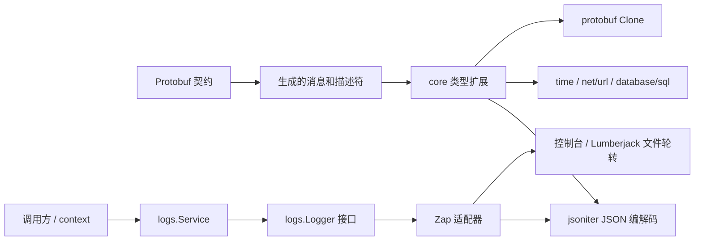

# Core 架构与函数说明

本仓库提供 fino 项目共享的 Protobuf 契约和 Go 基础运行时，不包含业务服务、数据库仓库或 HTTP 业务路由。Go 模块位于 `go/`，最低语言版本为 Go 1.22。

## 分层与依赖

| 层 | 位置 | 职责与维护方式 |
| --- | --- | --- |
| 契约 | `proto/fino/core/` | 值、时间、错误、URL、文件、资源和版本等共享消息；字段编号和包名是公共兼容性边界。 |
| 生成选项 | `proto/fino/options.proto`、`go/fino/options.pb.go` | 描述模型、服务等代码生成选项，与运行时业务逻辑分离。 |
| 生成类型 | `go/fino/core/*.pb.go` | 消息、枚举、描述符和基础 getter；修改契约后通过 Fino 重新生成。 |
| 类型扩展 | `go/fino/core/` 中的手写文件 | 构造、转换、集合操作、JSON 编解码、SQL 适配和错误分类。 |
| 日志 | `go/logs/` | `Logger` 接口、`Service` 便捷方法、上下文字段，以及 Zap、日志轮转和动态级别适配。 |

枚举的部分 `.fmt.go`、`.json.go` 也是生成文件，应以文件头的 `Code generated` 标记为准。时间和 URL 的同类文件是手写扩展，不能仅凭文件后缀判断。

生成文件保留生成器的类型写法，包括 `interface{}`；手写代码使用 `any`。日常重构只修改手写扩展，生成文件随契约和模板重新生成。



`logs` 没有直接依赖 `core`，两者可独立使用。应用导入 `core` 后，其 `init` 注册的 JSON codec 同样会影响日志反射编码中的这些类型。

## 函数功能地图

| 模块 | 主要入口 | 功能 |
| --- | --- | --- |
| 动态值 | `NewValue`、`New*Value`、`Value.GetKind`、`Get*`、`AsInterface` | 将 Go 数据包装为 Protobuf oneof，按类型读取，或转换成适合 JSON 的 Go 值。 |
| 对象 | `NewObjectFromMap`、`NewObjectFromKeyVals`、`NewObjectFrom` | 从映射、键值对或结构体构建 `Object`。 |
| 对象转换 | `Object.From`、`From2`、`To` | `From` 按 JSON 字段名、`omitempty` 和注册的 codec 完整替换内容；`From2` 保留为转发到 `From` 的兼容入口。`To` 解码到非 nil 指针。 |
| 对象操作 | `Set*`、`Get*`、`Merge`、`Clone`、`Delete`、`ToLowerCamelKeys`、`ToSnakeKeys` | 提供类型访问、合并、深复制、删除和键名转换。`Merge` 共享嵌套值，`Clone` 隔离整个对象树。 |
| 数组 | `NewValues`、`Values.AsSlice`、`New*ArrayValue`、`Get*Array` | 包装和读取动态数组。`Values` 的普通 JSON 表示为数组。 |
| 装箱值 | `BoolValue`、`Int*Value`、`StringValue`、`*Values`、`StringMap`、`StringsMap` | 可空标量及标量集合；普通 JSON 使用标量、数组和映射形式。 |
| 字符串集合 | `Append`、`Contains`、`Unique`、`Matched`、`Matches` | 追加、包含判断、保序去重和正则过滤；每次过滤只编译一次表达式，无效表达式返回不匹配。 |
| 时间点 | `Now`、`FromTime`、`ParseTimestamp`、`ToTime`、`Compare`、`Add`、`Sub`、`Date` | `time.Time` 与共享时间点之间的转换、解析、比较和运算。 |
| 时长 | `FromDuration`、`NewDuration`、`FromSeconds`、`ToDuration`、`ToSeconds`、`Compare` | 在秒/纳秒和 `time.Duration` 之间转换；纳秒舍入溢出时向秒进位。 |
| SQL | `Timestamp.Scan/Value`、`Duration.Scan/Value`、`GormDataType` | 实现 `sql.Scanner`、`driver.Valuer`；不引入 ORM 运行时依赖。 |
| URL | `ParseUrl`、`Url.Parse`、`Format`、`FormatWithoutSchema` | 通过 `net/url` 解析和格式化层次式 URL，处理 IPv6 和用户信息转义。 |
| 查询参数 | `NewUrlQuery`、`FromUrlValues`、`Has`、`Add`、`Set`、`Del`、`Unmarshal`、`UnmarshalParam` | 管理多值参数，解码标量、重复参数、逗号列表和 JSON；解码不修改原始参数。 |
| 错误 | `NewErrorFrom`、`NewError*`、`NewNotFoundError` 等分类构造器、`Is*Error`、`AsError`、`StatusCode` | 构造共享错误、匹配错误分类、提取 Protobuf 错误和映射 HTTP 状态。分类错误通过 `Unwrap` 接入标准错误链。 |
| 错误码 | `NewErrorCode`、`ParseErrorCode`、`ErrorCode.Format` | 从内置索引恢复名称、描述和 HTTP 状态，或保留未知业务码。 |
| 编码扩展 | `RegisterJSONTypeEncoder/Decoder`、`RegisterJSONFieldEncoder/Decoder`、`RegisterJSONValuesCodec` | 注册 jsoniter 类型、字段和集合 codec。应在包初始化时完成注册。 |
| 小型工具 | `ToString`、`Quote/Unquote`、`QuoteString`、`Options`、`CreatDir`、文件权限函数 | 标量格式化、字符串转义、选项映射、目录创建与权限位判断。 |
| 命名转换 | `strcase.ToLowerCamel`、`ToSnake`、`ToKebab`、`ConfigureAcronym` | 沿用已有 Ian Coleman/Ma_124 的 MIT 实现与缩写规则。 |
| 日志配置 | `NewDefaultConfig`、`NewLoggerWith`、`SetLogger`、`SetLogLevel` | 创建日志适配器，设置全局 logger 和动态级别。 |
| 日志调用 | `NewService`、`Ctx`、`WithContext`、`Debug/Info/Warn/Error/Fatal` 及 `f/w` 变体、`NewError*` | 提供普通、格式化和结构化日志，以及记录并返回错误的便捷入口。 |
| 日志上下文 | `WithFields`、`Logger.With` | 在上下文或派生 logger 上附加字段；派生调用不修改父级字段。 |

`Get*` 是按 oneof 类型读取的 getter，不承担字符串解析或任意类型强制转换；错误类型通常返回零值。较窄的整数 getter 使用现有的饱和截断规则。

## 数据约定

- `Value` 的整数字面量优先保留 `int64`/`uint64` 精度；小数和指数形式使用 `float64`。超出整数范围的数值也可能退回 `float64`，并受浮点精度约束。
- `NewValue([]byte)` 沿用无前缀的 Base64 字符串行为；需要二进制类型时使用 `NewBytesValue`，其普通 JSON 表示为 `"b64.<base64>"`。
- `NaN`、正负无穷在普通 JSON 中表示为 `"NaN"`、`"Infinity"`、`"-Infinity"`。编码不再主动截断浮点小数位。
- `Value`、`Object` 和 `Values` 的紧凑表示由 jsoniter codec 提供。Protobuf 的 `protojson` 根据契约字段编码，两套表示不能互换。使用标准 `encoding/json` 导出动态对象时，可先调用 `AsInterface`/`AsMap`。
- 集合的 nil 映射/切片表示 JSON `null`，非 nil 空集合表示 `{}`/`[]`，`AsMap`、`AsSlice` 与紧凑 JSON 保持一致。通用数组 codec 接受数组和 `null`，元素解码错误会返回调用方，失败时保留原切片。
- `Object.From` 和 `NewObjectFrom` 使用 JSON 转换，字段名保留原名或 `json` 标签，零值仅按 `omitempty` 省略，成功后替换全部字段。`nil` 输入清空映射，失败时保留原对象；nil 接收者安全返回。转换出的嵌套值与源对象隔离，但 JSON 转换可能规范化数值类型并丢弃 Protobuf 未知字段；保留完整 Protobuf 数据应使用 `Clone`。
- 数值 `Timestamp` 固定按 Unix 秒解码；日期字符串沿用 dateparse 的解析能力。`Timestamp.Format` 继续使用现有的毫秒输出格式。
- SQL `NULL` 扫描到已有 `Timestamp`/`Duration` 时清空秒和纳秒；若业务需要区分 NULL 和零值，应由包含这些字段的可空模型表达。
- `Duration` 的 JSON 数值与 SQL 秒数字符串优先按 int64 整数解析，保留整数边界精度；小数和指数形式按 float64 处理。超出秒字段范围或非有限输入返回错误并保留旧值。动态值、时间点和时长拒绝前导零、前导加号等非法 JSON 数字写法。
- `Url.Parse` 在完成 URL 和查询参数校验后更新接收者，失败时保留原值。当前契约不包含 `Opaque`，因此 `mailto:user@example.com` 等非层次式 URL 返回明确错误。
- `Options.SetValues` 和 `NewUrlQuery` 忽略非字符串键和尾部不完整的键值对。对 nil `Options` 写入时，需要保留方法返回的映射。
- 日志字段按初始配置、派生 logger、上下文、单次调用的顺序覆盖。同名字段只输出一次。文件输出默认使用 JSON；输出同步由 Zap 的锁封装处理。

## 本次优化与补充

| 原有不足 | 更新后的行为 |
| --- | --- |
| `Error.Is` 反复调用 `IsError` 导致递归；分类错误无法统一提取 | 浅层类型匹配加标准错误链，支持包装后的分类判断和 `AsError`。 |
| 错误实例共享内置错误码，JSON 解码后丢失 HTTP 元数据 | 构造时复制索引元数据；解析内置错误码时恢复状态、名称和描述。 |
| 分组数值类型断言错误、正则表达式和目标字符串顺序颠倒 | 使用标准反射数值访问、`strconv` 和编译后的 `regexp`。 |
| `Value` 解码吞掉错误，嵌套无效数据可能被接受；结构体转换损失大整数精度 | 解码错误逐层返回，集合在同一 iterator 上读取，整数先按原始文本解析。 |
| 动态数组混用 protojson 与紧凑 JSON，浮点编码主动丢精度 | 紧凑 JSON 数组路径一致，特殊浮点和二进制值与 `AsInterface` 对齐。 |
| `Object.From` 手动操作 unsafe 字段编码器，转换入口语义分散 | 统一为 jsoniter JSON 转换，删除字段规范化反射和编码器登记表；深复制复用 `proto.Clone`。 |
| URL 查询解码修改原数组，字符串转义不完整，零值查询对象写入 panic | 原值保持不变，复用 JSON 转义/解析并初始化映射。 |
| IPv6 缺失方括号、用户信息重复转义、解析失败留下半更新状态 | 复用 `net.JoinHostPort`/`net/url`，校验后统一写入。 |
| 时间 NULL 扫描留下旧值、纳秒舍入越界、数值时间单位依赖平台 | 明确 NULL 清零、舍入进位和 Unix 秒约定。 |
| 日志字段写入两遍、各级别重复分派、文件默认编码不一致 | 字段统一合并，通过 Zap 的 `Logger.Log` 写入并保留调用位置。 |
| 日志 `NewErrorf` 重复格式化，`%w` 导致日志出现格式错误 | 只调用一次 `fmt.Errorf`，日志使用返回错误的 `Error()` 文本，保留错误链。 |
| 目录创建把已有文件当成功 | 直接调用 `os.MkdirAll`，由标准库检查类型并返回错误。 |
| 通用数组和备用结构体 codec 吞掉元素/字段错误，部分 `null` 解码留下旧值 | 集合直接在当前 iterator 上解码并校验类型；数组失败保留旧值，URL、错误码及字符串集合显式处理 `null`。 |
| URL 字符串读取失败后仍调用解析，覆盖原对象 | 读取成功后才解析 URL，失败时不修改已有 URL，也不向指针字段写入新对象。 |
| 时长整数经 float64 转换损失精度，有限但越界的秒数被接受 | JSON 和 SQL 共用整数优先解析及浮点范围检查。 |

这次调整复用已有 jsoniter、Zap、Protobuf 和 Go 标准库，没有引入新运行时依赖，也未修改契约或生成的描述符。

进一步收敛了 `Object.Set*` 的返回路径、nil 安全 getter 的重复判断、对象/数组 codec 的空值处理、URL 参数列表解析以及时间点比较。映射合并复用 `maps.Copy`，正则存在性判断复用 `slices.ContainsFunc`，参数类型识别直接检查反射类型的接口实现，移除了无生产调用的 `isStringSlice`。

旧 `From` 调用方迁移时：用 `json` 标签指定字段名，按需添加 `omitempty`；需要 lowerCamel 键时显式调用 `ToLowerCamelKeys`，需要合并时将转换结果交给 `Merge`，需要无损深复制时调用 `Clone`。这些职责不再隐含在 `From` 的类型分支中。

## 已知限制与维护方向

- `b64.` 前缀和特殊浮点字符串属于现有的保留编码，普通字符串使用这些值时会产生语义歧义；更换编码需要制定公共兼容方案。
- `Duration.ToDuration` 和 `Format` 受 Go `time.Duration` 的 int64 纳秒范围限制；长时长读取秒数应使用 `ToSeconds`。构造秒数时应提供有限、可表示的数值。
- `Url` 没有 `RawPath`、`ForceQuery` 等字段，格式化会规范化部分 URL 细节；不能用于保留请求目标的全部原始字节。
- JSON codec 必须在启动时注册；jsoniter 会缓存编码器，不支持运行中修改 codec。
- `Object`、查询映射和单个 `Service.SetLogger` 的配置修改没有额外并发控制。配置应在启动时完成；跨请求共享可变对象由调用方同步。全局日志替换和级别调整已有同步机制。
- 动态日志级别 HTTP 服务和轮转文件的生命周期尚未暴露到公共 `Logger` 接口，替换 logger 不会关闭旧资源。后续扩展应考虑兼容现有自定义 logger。
- 枚举解析/JSON helper 的行为由 Fino 模板决定。需要改变生成行为时，应同时修改生成器模板并验证再生成结果。

## 简单验证

在仓库根目录执行：

```sh
make -C go test
make -C go vet
```

回归用例覆盖错误链与 HTTP 状态、整数边界、嵌套 JSON 错误、非法数字语法、特殊浮点、对象转换的字段/零值/替换/null 语义与自定义 codec、转换失败不变性、集合空值表示与通用数组 codec、备用结构体 codec、对象深复制、查询解码不变性、URL 用户信息、SQL NULL、时长越界、纳秒进位、日志字段覆盖和调用位置。日志级别服务的集成测试需要允许监听本机回环地址。
